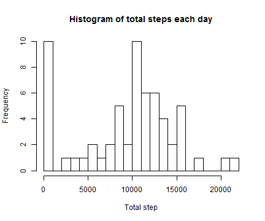
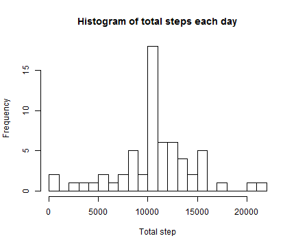
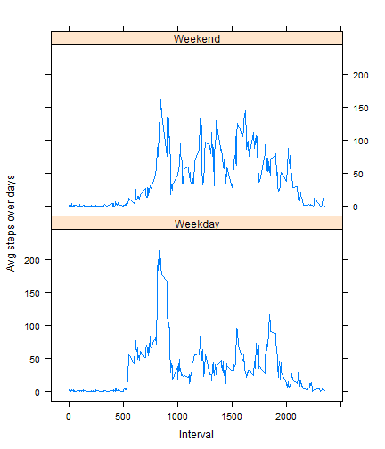

Reproducible Research: Peer Assessment 1
========================================================

## 1. Load & Process data


```r
library(plyr)
library(caret)
```

```
## Loading required package: lattice
## Loading required package: ggplot2
```

```r
activity=read.csv('E:/2015 Spring/Reproducible research/Assignment 1/activity.csv')
sum.daily.step <- ddply(activity,.(date),summarise, total.step = sum(steps, na.rm=TRUE))
```

## 2. What is mean total number of steps taken per day?

### 2.1 Calculate the total number of steps taken per day

```r
mean(sum.daily.step$total.step)
```

```
## [1] 9354.23
```

### 2.2 Make a histogram of the total number of steps taken each day

```r
hist(sum.daily.step$total.step, breaks=20, main = "Histogram of total steps each day",xlab='Total step')
```

 


### 2.3 Calculate and report the mean and median of the total number of steps taken per day

```r
mean(sum.daily.step$total.step)
```

```
## [1] 9354.23
```

```r
median(sum.daily.step$total.step)
```

```
## [1] 10395
```

## 3. What is the average daily activity pattern?

### 3.1 Make a time series plot (i.e. type = "l") of the 5-minute interval (x-axis) and the average number of steps taken, averaged across all days (y-axis)

```r
daily.pattern = ddply(activity,.(interval), summarize, freq=length(steps), totmiss = sum(is.na(steps)), 
                      totsteps = sum(steps, na.rm=T), mean.step = mean(steps, na.rm=TRUE))
plot(daily.pattern$interval, daily.pattern$mean.step,type='l', 
     ylab = "Avg steps over days", xlab = "Interval", main = "Time series plot")
```

 
### 3.2 Which 5-minute interval, on average across all the days in the dataset, contains the maximum number of steps?

```r
daily.pattern$interval[which.max(daily.pattern$mean.step)]
```

```
## [1] 835
```

## 4. Imputing missing values

### 4.1 Calculate and report the total number of missing values in the dataset (i.e. the total number of rows with NAs)

```r
sum(is.na(activity$step))
```

```
## [1] 2304
```

### 4.2 Devise a strategy for filling in all of the missing values in the dataset. The strategy does not need to be sophisticated. For example, you could use the mean/median for that day, or the mean for that 5-minute interval, etc.

#### Comment: I use the mean for each 5-minute interval to impute missing values. 

### 4.3 Create a new dataset that is equal to the original dataset but with the missing data filled in.

```r
merge.data=merge(activity,daily.pattern,by='interval')
merge.data=merge.data[order(merge.data$date,merge.data$interval),]
merge.data$imp.step=merge.data$steps
merge.data$imp.step[is.na(merge.data$steps)]= merge.data$mean.step[is.na(merge.data$steps)]
```

### 4.4 Make a histogram of the total number of steps taken each day and Calculate and report the mean and median total number of steps taken per day. Do these values differ from the estimates from the first part of the assignment? What is the impact of imputing missing data on the estimates of the total daily number of steps?

```r
sum.daily.step.2 <- ddply(merge.data,.(date),summarise, total.step = sum(imp.step, na.rm=TRUE))
hist(sum.daily.step.2$total.step, breaks=20, main = "Histogram of total steps each day",xlab='Total step')
```

 

```r
mean(sum.daily.step.2$total.step)
```

```
## [1] 10766.19
```

```r
median(sum.daily.step.2$total.step)
```

```
## [1] 10766.19
```
### Answer: From the result we can see that mean and median increase.


## 5. Are there differences in activity patterns between weekdays and weekends?
### 5.1 Create a new factor variable in the dataset with two levels - "weekday" and "weekend" indicating whether a given date is a weekday or weekend day.

```r
merge.data$Weekday <- weekdays(as.Date(merge.data$date))
merge.data$is.weekend <- ifelse(merge.data$Weekday %in% c('Saturday','Sunday'),'Weekend','Weekday')
daily.pattern.2 = ddply(merge.data,.(is.weekend,interval), summarize, freq=length(steps), 
                      totsteps = sum(imp.step, na.rm=T), mean.step = mean(imp.step, na.rm=TRUE))
```

### 5.2 Make a panel plot containing a time series plot (i.e. type = "l") of the 5-minute interval (x-axis) and the average number of steps taken, averaged across all weekday days or weekend days (y-axis). 

```r
library(lattice)
xyplot(mean.step~interval | is.weekend, data=daily.pattern.2, type="l",
       layout = c(1,2), ylab = "Avg steps over days", xlab = "Interval")
```

 

### Comment: It is interesting to see that during weekday, 8:35 am has the highest steps. While during the weekend, the steps are relatively spread over the day. 


